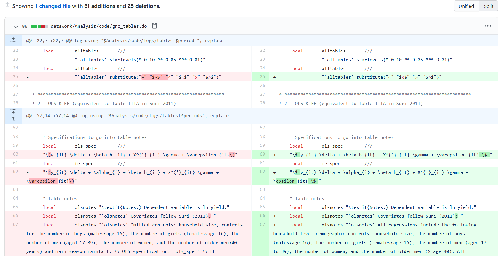
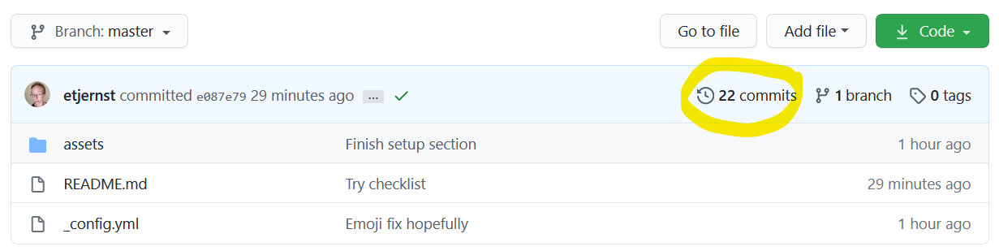

# Git tutorial

## Index
* [Before we start](#before-start)
* [Git basics](#git-basics)
* [Git vocab](#git-vocab)
  - [1. `repo`](#repo)
  - [2. `clone`](#repo)
  - [4. `commit`](#commit)
  - [3. `stage`](#stage)
  - [0. `pull`](#pull)
  - [5. `push`](#push)  
* [First time setup](#step-0)
* [New project setup](#project-setup)
* [Practice 1: staging and committing](#practice-stage-commit)
* [Basic workflow](#basic-workflow)
* _[Branches](#introducing-branches) (coming soon)_
* [Useful commands](#useful-commands)

---

## <a name="before-start">Before we start</a>

Before embarking on this tutorial, you need two things:
1. A [GitHub](https://github.com) account
  > :exclamation:
  Make sure that I have added you as a collaborator to the repository called [Tutorials](https://github.com/etjernst/Tutorials).
  >
  > If you are logged in to GitHub but clicking on this link takes you to a 404 error page, then most likely you are not a contributor yet!

2. You need to install a git client on your computer.
  > When you download the relevant install [here](https://git-scm.com/downloads), you should automatically get git bash. This tutorial will use git bash, but there are many other user interfaces. You can find tons of other options [here](https://git-scm.com/downloads/guis).

3. _Recommended:_ Read ["Code and Data for the Social Sciences"](https://web.stanford.edu/~gentzkow/research/CodeAndData.pdf)

---

## <a name="git-basics">Git basics - what is this thing?</a>

Git is the most popular version control system. Basically, if Dropbox and the "track changes"
feature in MS Word had a baby, Git would be that baby.

In fact, it's even better than that!
Git is optimized for the things that applied economists
spend a lot of time working on (e.g. code).
There is a learning curve, but it's worth it---your life will be changed for the better. _Really!_

{:height="75%" width="75%"}

### Git vs GitHub
Git and GitHub are not the same!

**Git** is a local tool, i.e. it lives on your computer and
  - uses version control to make collaboration infinitely better
  - allows simultaneous editing _and_ execution of scripts
  - gives very detailed comparisons of histories and alternate versions---and allows alternate versions to co-exist for as long as you want!
  - greatly facilitates transparent and reproducible research

**GitHub** lives in the cloud; it's a hosting platform that provides a bunch of services built on top of the Git system
 > I use the command line for most things, but some things I find easier to do in GitHub.
 >
 > For example, when comparing two versions of code (to see what my co-authors have done, for example), I find the GitHub interface more useful. For example, it makes it very easy to go through code and compare changes across versions:
 

 [Back to top](#Index)

---

## <a name="git-vocab">Git vocab</a>

There's a lot of terminology and details around git. I don't know/understand half of it. The beauty is that you don't have to understand
how git works to start using it!

Some terms are useful though (makes it easier to search help files):

#### <a name="repo">1. Repository (a.k.a. _repo_)</a>
_= basically a project folder_

A repo contains all files associated with a project
  (including any associated  documentation). Your project repo also stores **every file's revision history**.

Repos can have multiple collaborators and can be either public or private.

You can get a repo in two main ways:
1. You can `clone` an existing Git repository from elsewhere
  > If you have created a repo already, or are joining a project that someone else already made a repo for, this is for you

2. You can take a local directory (folder) that is currently not under version control, and turn it into a Git repository
  > If you already have a project folder that you want to start using version control with, this is for you

Ok, so what is `cloning`?

#### <a name="clone">2. `Clone`</a>
_to `clone` a repo is to "download" it (...kinda)_

A clone is a copy of a repository that lives on your computer (instead of in the cloud somewhere).

So why did I put "download" in scare quotes?
The main difference between cloning and downloading is that when
git clones a repo, it pulls down a full copy of all versions of every file and folder for the project AND
it remembers where you downloaded it from!

The cloned repo stays connected to the _remote_ version (i.e. the one in the cloud), so when you make local changes to your file, git knows where these should go when you decide to push them to the remote version

> :exclamation: If you instead decided to download the repo, you would just get
the most recent files on the default branch. In brief, you
wouldn't get any of the magic (i.e., the .git folder) and you can no longer use git in the downloaded folder

#### <a name="commit">4. `Commit`</a>
_= a revision_

Above, I mentioned that a project repo stores every file's revision history. How do changes make it into the history? And how is it different from, say, how this works in Dropbox.

Dropbox does version control, right?
You can click on files and see previous versions.
One issue is that you get a new version every single time you  press `Ctrl+S` or click save. If you click `Ctrl+S` a lot (like I do), you end up with tons of changes.

How many of these are meaningful changes? And how would I figure
out a week from now (or three years from now!) which of these
changes did something specific when I try to remember?


In git, you use `commits` to indicate (and describe!)
each meaningful difference between two versions of the project folder. Each commit is a snap shot of all files in the project folder, and lists how that snapshot differs from
the previous snapshot (i.e., the previous commit)

So instead of having a list of each saved version of a file, in git you use commits.


Each commit has a time stamp and tracks who did the commit.
Commits should also contain a commit message, i.e. a _brief_ summary of
the changes in that commit.
Back in the bad old days, I used to save new versions of files all the time (`YYMMDD_docname_INITIALS.doc`)...
This is like that, except _much_ better!

When you make a commit to save your work,
git creates a unique ID (a `hash`) that allows you to keep track
of the specific changes committed---as well as who made them and when.


> :exclamation:
**You have to tell Git when to create
new commits and what to call them.**

This is likely the biggest difference compared to your current workflow.
Git is always watching your changes, but it doesn't store them
until we commit them.

#### <a name="stage">3. `Stage`</a>
_= tell git to mark the files that you will include in your next commit_

Staging is kind of an intermediate step between saving a file locally and creating the commit.
(So yes, the numbering is out of order on purpose :smile:)
I am not 100% sure why this step exists.
To make it more confusing, the actual command is `add`, not stage.
As in, you are _adding_ a file to the staging area.

<details> <summary> If you want my best guess, click here (not necessary)</summary>

My best guess/explanation is the following:
say you are testing out a robustness check.
This requires you to edit several .do files.
So you edit `masterDoFile.do` and add it to the staging area:
```bash
git add "$projectFolder/masterDoFile.do"
```
Then you make some changes to the estimation code, `estimationCode.do` and add that to the staging area:
```bash
git add "$projectFolder/analysis/estimationCode.do"
```
You can then commit both files, i.e. add them to the version history with a useful message:
```bash
git commit -m "Robustness check for Table 3"
```
Logically, you changed both of these files in the process
of running a robustness check but maybe you don't see a reason to have a different commit for the two files.
So the staging step recording what _files_ you have changed and the commit
</details>

<br>

#### <a name="pull">0. `Pull`</a>
_to `pull` changes = syncing changes from the remote (e.g. GitHub) to your local repo_

When you pull from a repository, you retrieve all
commits from that remote repository and
merge them into the local repository.
You should do this before you start working (which is why I numbered it "0")

#### <a name="push">6. `Push`</a>
_= send your (committed) changes to a remote repository (e.g., on GitHub)_

If you change something locally, nobody else will have access to those changes until you _push_ them to the remote repo.

[Back to top](#Index)

---

## <a name="step-0"> First-time set-up</a>
| :pushpin:  <br> You should do this the very first time you are using git on a computer. Then you should not have to do it again. |
|  :---  |

### Introduce yourself to git
1. Open up git bash, which should have come with the git installation.
2. Set your name, which will be attached to your commits
```bash
git config --global user.name "[yournamehere]"
```
3. Set your email (should be the same email that you used to sign up for GitHub)
```bash
git config --global user.email "[youremailhere]"
```

Hopefully so far, so good!

[Back to top](#Index)

---

## <a name="project-setup">New project setup</a>
| :pushpin:  <br> You only need to follow these steps the first time you work with a project on a given computer. Then you should be able to follow the workflow below. |
|  :---  |


You can follow these steps with a public repo,
or with a private repo to which you've been added as a collaborator.

0. Open git bash (if not already open)
1. Check the working directory (this will show you where you are currently working):
   ```bash
   pwd
   ```
2. Assuming that this is not where you want your git repo to live, you need to change the directory. You can do this either by
typing `cd` followed by the location where you want the clone to live
or click-and-drag the folder into the bash window:
  {:height="75%" width="75%"}
  > :exclamation: Note that most people recommend not placing git-related things (repos, clones) in Dropbox or other cloud syncing services.
  >
  > I just keep a `git` folder on my Desktop with all my repos in it.
To do the same, follow these steps:
> ```bash
> cd        ~/Desktop/
> mkdir     git
> cd        git
> ```


3. Ok, now let's clone a repo into the `git` folder
   - Go to the repo you want to clone (e.g., [https://github.com/etjernst/Tutorials](https://github.com/etjernst/Tutorials))
   - Click the green Code button, which should drop down and yield something like this:
   
   - Click the clipboard symbol (copies the URL)
   - Back in bash, type
   ```bash
   git clone [thing-you-just-copied]
   ```
  > _Hint:_ on Windows, typing `Shift+Insert` is a shortcut for paste in git bash

:question: Navigate to your git folder. What do you see?

4. Tell bash to use the cloned repo as the working directory:
   ```bash
   cd [repo-name-that-you-just-cloned]
   ```
> In the case of my Tutorials repo, this would simply be `cd Tutorials`

---

## <a name="practice-stage-commit">Practice staging and committing</a>

1. Add a new file to the repo. Let's add it inside a folder called _practice_:
   - To do this, first create the folder _practice_ using the command `mkdir` (or you can navigate to your repo and add the folder manually---it doesn't matter)
   - Then use the command `touch` to create a new file called `yourName.md`
     ```bash
     mkdir practice
     touch practice/[yourName.md]
     ```
      The `.md` extension tells us that this is in markdown format. Markdown is easy to edit in any text editor.
      [Here](https://github.com/adam-p/markdown-here/wiki/Markdown-Cheatsheet) is a markdown cheat sheet
      for future reference.
2. Now type `git status` in bash
  > :question: What do you see?

3. Open up the file with your favorite text editor and add
the text _"About to do my first git commit!"_ and save the file.
4. `stage` the changes:<br>
Back in git bash, add the file to the staging area (first type `git status` again to see what has changed---it's useful to get a sense of what the results look like):
   ```bash
   git status
   git add practice/[yourName.md]
   ```
5. Create a `README-practice.md` file in the `practice` folder, add the text _Hello world!_ to the file, and save it.
   <details><summary>Code hint below</summary>

   ```bash
   touch practice/README-practice.md
   ```
   </details>
6. Stage your changes.
   <details><summary>Code hint below</summary>

   ```bash
   git status
   git add practice/README-practice.md
   ```
   </details>
7. Now commit your changes. You have staged the changes to both of these files, so they will both be added to the same commit.
> :exclamation: Don't forget to add a commit message summarizing your commit!
```bash
git commit -m "Your very helpful commit message"
```
8. Now, to make sure that you haven't missed any changes that someone else (or past-you from a different machine) have implemented, `pull` from the remote repo:
```bash
git pull origin
```

9. Most likely, you will see the message `Current branch master is up to date.` It is then safe to push your changes to the remote:
```bash
git push origin master
```
> :exclamation: We will use branches later to make the process safer, but for now just push to the master branch
>
> I know, more weird terminology---just what we needed, right?

10. Ok, now to see the fruits of your labor: navigate to the [repo](https://github.com/etjernst/Tutorials) and click on the link that says `# commits`:

    - Click on the `hash` that corresponds to your commit (some combination of letters and numbers)
    - You should see a nice summary of your changes
    - On the right, you can select if you want to see the changes as `unified` or `split` (side by side)

:question: How cool is that?

[Back to top](#Index)

---

## <a name="basic-workflow">Basic workflow</a>
The steps below outline the general workflow of git. We will complicate it a bit soon with branches, but this covers the basics.

1. `pull` from the remote repo:
   ```bash
   git pull origin master
   ```
> Do this each time before you start working, to make sure you aren't missing any updates
2. Make changes to files, working as you normally would; save changes in your local clone
3. `stage` these local changes (add files to the staging area):
   ```bash
   git add [fileA]
   git add [fileB]
   ```
4. `commit` these local changes to your Git history, adding a logical commit message:
   ```bash
   git commit -m "Updated bootstrap routine"
   ```
5. `pull` from the remote repo just in case anyone else made changes too:
   ```bash
   git pull origin master
   ```
> :exclamation: I recommend always doing this even if you are working on your own!
6. `push` your changes to the remote repo on GitHub:
   ```bash
   git push origin master
   ```

---


## Introducing branches

Branches are the killer feature of git. It's what distinguishes git as a powerful collaboration tool.

Branches = time travel & parallel universes!

**More details on branches coming very soon**

---

## Useful commands

Some more git commands that might be useful:

`git add -A` _stage all files_ <br>
`git add -u` _stage updated files only (i.e., modified or deleted, but not new)_ <br>
`git add .` _stage new files only (i.e. not updated)_ <br>
<br>


If you mess up but don't want to delete your branch, you can "overwrite" your branch with
  what is on the master. Make sure you are on your branch:
```bash
git checkout [yourbranch]
```
Then basically overwrite it with the info on the master:
```
git pull origin master
```
---

_Sources:_
* Grant McDermott's great [lecture notes](https://github.com/uo-ec607/lectures)
* Trainings and resources from the World Bank's DIME unit (both [here](https://github.com/worldbank/DIME-Resources) and [here](https://worldbank.github.io/dimeanalytics/git/))
* The [GitHub documentation glossary](https://docs.github.com/en/github/getting-started-with-github/github-glossary)
* [Pro Git](https://git-scm.com/book/en/v2) by Chacon & Straub
