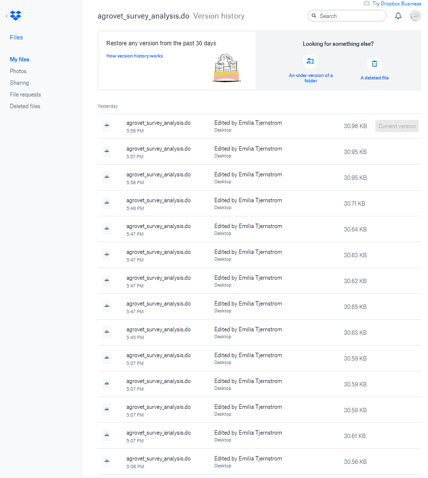
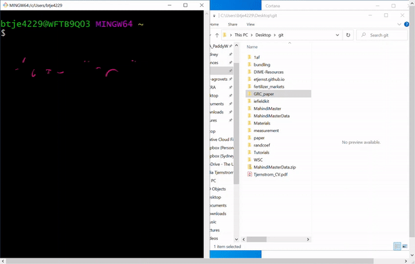
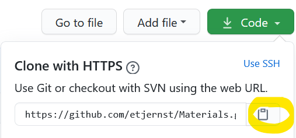

# Git tutorial

## Index
* [Before we start](#before-start)
* [Git basics](#git-basics)
* [Git vocab](#git-vocab)
  - [1. `repo`](#repo)
  - [2. `clone`](#repo)
  - [4. `commit`](#commit)
  - [3. `stage`](#stage)
  - [0. `pull`](#pull)
  - [5. `push`](#push)  
* [First time setup](#step-0)
* [New project setup](#project-setup)
* [Practice 1: staging and committing](#practice-stage-commit)
* [Basic workflow](#basic-workflow)
* [Branches](#introducing-branches)

---

## <a name="before-start">Before we start</a>

Before embarking on this tutorial, you need two things:
1. A [GitHub](https://github.com) account
  > :exclamation:<br>
  Make sure that I have added you as a collaborator to the repository called [Tutorials](https://github.com/etjernst/Tutorials).
  If you are logged in to GitHub but clicking on this link takes you to a 404 error page, then most likely you are not a contributor yet  :smile:

2. You need to install a git client on your computer.
  > When you download the relevant install [here](https://git-scm.com/downloads), you should automatically get git bash. This tutorial will use git bash, but there are many other user interfaces. You can find tons of other options [here](https://git-scm.com/downloads/guis).

3. _Recommended:_ Read ["Code and Data for the Social Sciences"](https://web.stanford.edu/~gentzkow/research/CodeAndData.pdf)

---

## <a name="git-basics">Git basics - what is this thing?</a>

Git is the most popular version control system. Basically, if Dropbox and the "track changes"
feature in MS Word had a baby, Git would be that baby.

In fact, it's even better than that!
Git is optimized for the things that applied economists
spend a lot of time working on (e.g. code).
There is a learning curve, but it's worth it---your life will be changed for the better. _Really!_

{:height="75%" width="75%"}

### Git vs GitHub
Git and GitHub are not the same:
**Git** is a local tool, i.e. it lives on your computer and
  - uses version control to make collaboration infinitely better
  - allows simultaneous editing _and_ execution of scripts
  - gives very detailed comparisons of histories and alternate versions---and allows alternate versions to co-exist for as long as you want! (we'll get back to this below)
  - greatly facilitates transparent and reproducible research

**GitHub** lives in the cloud; it's a hosting platform that provides a bunch of services built on top of the Git system
 > I use the command line for most things, but some things I find easier to do in GitHub. For example, when comparing two versions of code (to see what my co-authors have done, for example), I find the GitHub interface more useful.

 [Back to top](#Index)

---

## <a name="git-vocab">Git vocab</a>

There's a lot of terminology and details around git. I don't know/understand half of it. The beauty is that you don't have to understand
how git works to start using it!

Some terms are useful though (makes it easier to search help files):

#### <a name="repo">1. Repository (a.k.a. _repo_)</a>
_= basically a project folder_

A repo contains all files associated with a project
  (including any associated  documentation). Your project repo also stores **every file's revision history**.

Repos can have multiple collaborators and can be either public or private.

You can get a repo in two main ways:
1. You can `clone` an existing Git repository from elsewhere
  > If you have created a repo already, or are joining a project that someone else already made a repo for, this is for you

2. You can take a local directory (folder) that is currently not under version control, and turn it into a Git repository
  > If you already have a project folder that you want to start using version control with, this is for you

Ok, so what is `cloning`?

#### <a name="clone">2. `Clone`</a>
_to `clone` a repo is to "download" it (...kinda)_

A clone is a copy of a repository that lives on your computer (instead of in the cloud somewhere).

So why did I put "download" in scare quotes?
The main difference between cloning and downloading is that when
git clones a repo, it pulls down a full copy of all versions of every file and folder for the project AND
it remembers where you downloaded it from!

The cloned repo stays connected to the _remote_ version (i.e. the one in the cloud), so when you make local changes to your file, git knows where these should go when you decide to push them to the remote version

> :exclamation: If you instead decided to download the repo, you would just get
the most recent files on the default branch. In brief, you
wouldn't get any of the magic (i.e., the .git folder) and you can no longer use git in the downloaded folder

#### <a name="commit">4. `Commit`</a>
_= a revision_

Above, I mentioned that a project repo stores every file's revision history. How do changes make it into the history? And how is it different from, say, how this works in Dropbox.

Dropbox does version control, right?
You can click on files and see previous versions.
One issue is that you get a new version every single time you  press `Ctrl+S` or click save. If you click `Ctrl+S` a lot (like I do), you end up with tons of changes.

How many of these are meaningful changes? And how would I figure
out a week from now (or three years from now!) which of these
changes did something specific when I try to remember?



In git, you use `commits` to indicate (and describe!)
each meaningful difference between two versions of the project folder. Each commit is a snap shot of all files in the project folder, and lists how that snapshot differs from
the previous snapshot (i.e., the previous commit)

So instead of having a list of each saved version of a file, in git you use commits.


Each commit has a time stamp and tracks who did the commit.
Commits should also contain a commit message, i.e. a _brief_ summary of
the changes in that commit.
Back in the bad old days, I used to save new versions of files all the time (`YYMMDD_docname_INITIALS.doc`)...
This is like that, except _much_ better!

When you make a commit to save your work,
git creates a unique ID (a `hash`) that allows you to keep track
of the specific changes committed---as well as who made them and when.


> :exclamation:
**You have to tell Git when to create
new commits and what to call them.**

This is likely the biggest difference compared to your current workflow.
Git is always watching your changes, but it doesn't store them
until we commit them.

#### <a name="stage">3. `Stage`</a>
_= tell git to mark the files that you will include in your next commit_

Staging is kind of an intermediate step between saving a file locally and creating the commit.
(So yes, the numbering is out of order on purpose :smile:)
I am not 100% sure why this step exists.
To make it more confusing, the actual command is `add`, not stage.
As in, you are _adding_ a file to the staging area.

<details> <summary> If you want my best guess, click here (not necessary)</summary>

My best guess/explanation is the following:
say you are testing out a robustness check.
This requires you to edit several .do files.
So you edit `masterDoFile.do` and add it to the staging area:
```bash
git add "$projectFolder/masterDoFile.do"
```
Then you make some changes to the estimation code, `estimationCode.do` and add that to the staging area:
```bash
git add "$projectFolder/analysis/estimationCode.do"
```
You can then commit both files, i.e. add them to the version history with a useful message:
```bash
git commit -m "Robustness check for Table 3"
```
Logically, you changed both of these files in the process
of running a robustness check but maybe you don't see a reason to have a different commit for the two files.
So the staging step recording what _files_ you have changed and the commit
</details>

<br>

#### <a name="pull">0. `Pull`</a>
_to `pull` changes = syncing changes from the remote (e.g. GitHub) to your local repo_

When you pull from a repository, you retrieve all
commits from that remote repository and
merge them into the local repository.
You should do this before you start working (which is why I numbered it "0")

#### <a name="push">6. `Push`</a>
_= send your (committed) changes to a remote repository (e.g., on GitHub)_

If you change something locally, nobody else will have access to those changes until you _push_ them to the remote repo.

[Back to top](#Index)

---

## <a name="step-0"> First-time set-up</a>
| :pushpin:  <br> You should do this the very first time you are using git on a computer. Then you should not have to do it again. |
|  :---  |

### Introduce yourself to git
1. Open up git bash, which should have come with the git installation.
2. Set your name, which will be attached to your commits
```bash
git config --global user.name "[yournamehere]"
```
3. Set your email (should be the same email that you used to sign up for GitHub)
```bash
git config --global user.email "[youremailhere]"
```

Hopefully so far, so good!

[Back to top](#Index)

---

## <a name="project-setup">New project setup</a>
| :pushpin:  <br> You only need to follow these steps the first time you work with a project on a given computer. Then you should be able to follow the workflow below. |
|  :---  |


You can follow these steps with a public repo,
or with a private repo to which you've been added as a collaborator.

0. Open git bash (if not already open)
1. Check the working directory (this will show you where you are currently working):
   ```bash
   pwd
   ```
2. Assuming that this is not where you want your git repo to live, you need to change the directory. You can do this either by
typing `cd` followed by the location where you want the clone to live
or click-and-drag the folder into the bash window:
  {:height="75%" width="75%"}
  > :exclamation: Note that most people recommend not placing git-related things (repos, clones) in Dropbox or other cloud syncing services.
  >
  > I just keep a `git` folder on my Desktop with all my repos in it.
To do the same, follow these steps:
> ```bash
> cd        ~/Desktop/
> mkdir     git
> cd        git
> ```


3. Ok, now let's clone a repo into the `git` folder.
   1. Go to the repo you want to clone (e.g., [https://github.com   etjernst/Materials](https://github.com/etjernst/Materials))
   2. Click the green Code button, which should drop down and yield   something like this:
   
   3. Click the clipboard symbol (copies the URL)
   4. Back in bash, type
   ```bash
   git clone [thing-you-just-copied]
   ```
   > _Hint:_ on Windows, typing `Shift+Insert` is a shortcut for paste in git bash

:question: Navigate to your git folder. What do you see?

4. Tell bash to use the cloned repo as the working directory:
```bash
cd [repo-name-that-you-just-cloned]
```
> In the case of my Materials repo, this would simply be `cd Materials`

---

## <a name="practice-stage-commit">Practice staging and committing</a>

1. In your local clone, open up the README.md file in a text editor.
It is in markdown format, which is easy to edit in any text editor.
[Here](https://github.com/adam-p/markdown-here/wiki/Markdown-Cheatsheet) is a markdown cheat sheet
if you want to try any more fancy things (and for future reference).

2. Under collaborators, add your name to the file. `<br>` tells markdown that you want a new line.
3. Save the file.
4. Using git bash, add a folder in the repo called Various using `mkdir Various`, which will create the folder in the working directory. 5. Create a folder inside Various with your name. As you probably guessed, you will type `mkdir Various/your_name`.
6. Manually add a .do file to the folder called test.do (you can drag-and-drop, copy-paste, or "save as" or whatever other way you prefer).
  > You can add whatever you usually add at the top of .do files if you have a template of some kind.
6. Go back into git bash.
7. Check what changes have been made, by asking git the status of your local repository: `git status`
  > You should see the changes pop up
8. _Stage_ the changes you just made in your local clone: `git add [file]`
  > Here \[file\] is the file you saw listed as changed above -- for now just add each file separately;
later we'll learn to do this with shortcuts
  > You should see both the readme.md and your .do file show up when you type `git status`._
9. _Commit_ these local changes to your git history (with a helpful message!): `git commit -m "[very helpful message]"`
  > This will tell git that you are serious about these changes and want to commit them to memory
10. _Pull_ from the GitHub repo **just in case** anyone else made changes while you were working: `git pull`
  > This will check if anyone else has made changes to the original repo (and is also why I introduce branches below)
11. _Push_ your changes to the GitHub repo: `git push`
12. Go to the repo that you cloned originally on GitHub.
  > Somewhere on the left near the top there's a link that says "# commits" (where # is a number)
13. Click on your recent commit. What do you see?

The main repo with code will live on GitHub, and then we work on a local clone, pulling and pushing our changes to GitHub.
We will not sync data to GitHub (only code). There are a few reasons for this:
  * the only "real" data is the raw data. As such, we should always be able to get from that raw data to the
  analysis data using scripts (.do files in the case of Stata) -- so if you share data files with someone,
  they should be able to take your scripts and reproduce your entire paper with the click of a button!
  * data files are binary so not very useful to version control
  * data files can be large, which will slow down syncing

So, we need to make a local clone! This is basically a local copy of everything on GitHub, with its own git version control
keeping track of everything that you are doing.

2. Tell git to clone everything that is on GitHub to a local directory
  `git clone [file_path_here]`    
  > replace [file_path_here] with https://github.com/etjernst/Tutorials.git<br>
  > (this will create a folder called Tutorials wherever you pointed to in the above command)<br>
3. Now you want git bash to use that folder as your working directory, so tell it to do that<br>
  `cd [repo_name]`
  > replace [repo_name] with Tutorials
<br>

**Note that you don't need to follow all these steps every time you work, only the first time**
**-- that's why I called these steps Step 0.** <br>
Once you've done all this, you can just
1. _pull_ (important to do this **before** you start working locally since these changes can get overwritten)
2. work in your working directory
3. save your work
4. _stage_ each meaningful change
5. _commit_ those changes (with a useful message)
6. _pull_ to make sure you didn't miss changes
6. and _push_ the changes.

## Committing


<br>
In order to have multiple people working in the same repository, you also need to know how to _branch_,
but first let's practice doing a little commit.<br>


> Hopefully that all goes well! If not, please feel free to shoot me emails with questions. <br>
> You can always include screenshots of what is going wrong, or refer me to a specific point in this doc where you got stuck!<br>
> Hopefully, though, it will all run smoothly!

[Back to top](#Index)

---

## <a name="basic-workflow">Basic workflow</a>
The steps below outline the general workflow of git.<br>
When you use them going forward you will replace the square brackets with the relevant info
(without the square brackets) <br>
1. **Make** changes to a file & save them in your local clone
2. **Stage** these local changes:<br>
  `git add [file]`
3. **Commit** these local changes to your Git history (with a helpful message!)<br>
  `git commit -m "[very helpful message]"`
4. **Pull** from the GitHub repo *just in case* anyone else made changes too:<br>
  `git pull`
   > I recommend always doing this even if you are working on your own!<br>
   > But always commit or at least stash your changes before pulling from the remote
5. **Push** your changes to the GitHub repo:<br>
  `git push`
---


## Introducing branches

Branches are the killer feature of git. It's what distinguishes git as a powerful collaboration tool.<br>
<br>
Branches = time travel & parallel universes:
* Branches enable different people to work on the same thing at the same time.
* Branches enable you to view different versions of your files.
* In fact, branching allows you to _move forwards or backwards in time_; and to move "horizontally" in time through various concurrent versions.
* You can essentially take a snapshot of your existing repo and try out a whole new idea without affecting your main
(i.e. "master") branch.
* Once you (and your collaborators) are 100% satisfied, then you can merge this new test code back into the master branch.
* This is how most new features in modern software and apps are developed but researchers can easily us it.
* Say you want to try a new way of creating a variable and see how that changes results.
You can do that in a branch in order to not mess up the master branch.
  > If you like the result you can merge your experiment with the main version of the code.<br>
  > BUT if you aren't happy, then you can just delete the experimental branch and continue as if nothing happened.


<br>
Research is a highly nonlinear process, and this way of doing version control is much more similar to how we actually work
than the very linear way that Dropbox (for example) does version control.<br>
I mostly use branches with our names. But a branch can also be called something specific like ``newvardef`` or ``robustness``.<br>

To make sure we know what we are doing, we need to organize our commits and branches.<br>
This is non-trivial.<br>
You have to think in ways you are not used to thinking when you start
using Git, so these workflows will not feel intuitive.<br>
But they are worth learning, since Git will be less useful otherwise.<br>

Good practice is to use a few main branches:
1. [master] branch: protected, "ready to run", and with sparse commits from [working]
2. [working] branch is protected, "nearly" ready to run, and has frequent commits from [user] or [feature] branches
3. [user] or [feature] branches are frequent, specific, personal, and hold all new work
<br>

We will now start working with our main repo (instead of Tutorials).
Repeat the cloning step from above,  replacing file_path as relevant with the link to your repo<br>
(you can get the link from going to the main page of the repo and clicking the green ``Clone or download`` button):

## Clone the relevant repo into the working directory

1. Set the working directory to where you want to work from (again, you can either type the filepath or drag and drop the
folder onto the git bash window)<br>
  `cd [filepath/drag file]`
  or<br>
  `cd [localfilepath]`
2. Tell git to clone everything that is on GitHub to a local directory<br>
  `git clone [file_path_here]`
3. Now you want git bash to use that folder as your working directory, so tell it to do that<br>
  `cd [repo_name]`    
  > replace [repo_name] with our repo name<br>

## Step 1 - Make a branch

It will be easiest to collaborate if we work on different branches.<br>
I will protect the master branch so you will not be able to push to it.<br>

To try this out:
1. Create a branch on your local computer and switch to it. Let's call this branch "cheese".<br>
    `git checkout -b [NAME-OF-YOUR-NEW-BRANCH]`
2. Push the new branch to GitHub (to let your collaborators know that it exists).<br>
    `git push origin [NAME-OF-YOUR-NEW-BRANCH]`
3. List all branches on your local machine.<br>
    `git branch`
    > Cool! You made a branch!
4. Let's say that you decide that you no longer want to keep the branch. Maybe cheese wasn't the best name. Delete it:<br>
    `git branch -d [NAME-OF-YOUR-FAILED-BRANCH]`
    `git push origin :[NAME-OF-YOUR-FAILED-BRANCH]`
    > Now the _origin_ repo on GitHub knows that you have deleted your branch.
5. Make a new branch called [your-name] following steps 1-3. Open our repo on GitHub and look for your branch. Do you see it?
6. Search [google schoolar](https://scholar.google.com) for the below paper.
7. Add a folder using `mkdir` as in the other tutorial. Call the folder Literature. (You are now adding this folder _in your branch on your local clone_).
8. Back in your browser, click on the "Cited by" link below the article

9. Select the box that says "Search within citing articles" and search for "Kenya"
(this is a great way to find papers -- if you know one paper that you like, you can find related papers that cite it).
10. Pick a paper that sounds interesting to you, and save it in the literature folder as well.
11. Stage and commit (with comments) the changes that you have made so far.
    > At the bottom of this file you can also see some nice shortcuts that will come in handy in the future.
12. Make a folder called Various/your_name folder using `mkdir` and add a file in it (either manually or using `mkdir`) called your_name_updates.md <br>
    > Remember, you are still on your branch in your local clone
    > You should be able to open an empty text editor window and then save the file with the .md file extension.
13. Type today's date and add a short summary of what you just did. Feel free to add any questions here too.
14. Stage these changes, too.
    > Remember, you can type `git status` to see what has changed.<br>
    > Then type `git add [filename]` to _stage_ the changes.<br>
15. Commit your changes(with comments).
    > Remember, you commit using `git commit -m "[Helpful comments]"`<br>
16. Once you have committed your changes, you should _pull_ from the remote repo to make sure nobody has made other changes while you were working!<br>
    > This gives you git a chance to merge the other changes into your local clone, but your changes are safe since you have committed them.<br>
    > Do this with `git pull`
17. Finally, push the changes to the remote repo on GitHub using `git push origin [your-branch-name]`
18. Go to our repo on GitHub and look for your changes. Do you see them?
Look for a tab that says branches and switch to your branch. You should see them now.<br>
  > What do you see?

19. When you eventually want to merge your changes in to one of the main branches,
you do this with a pull request. I find that easiest to do directly on GitHub actually.
  > I will then get a notification.

---

## Other stuff

### Some more git commands that might be useful at this point
`git add -A` _stage all files_ <br>
`git add -u` _stage updated files only (i.e., modified or deleted, but not new)_ <br>
`git add .` _stage new files only (i.e. not updated)_ <br>
<br>
  > If you mess up but don't want to delete your branch, you can "overwrite" your branch with
  what is on the master. Make sure you are on your branch:<br>
`git checkout [yourbranch]` <br>
  > Then basically overwrite it with the info on the master: <br>
`git pull origin master` <br>

### Some more branch-related options
If you want to switch back to the master branch (or any other branch)<br>
`git checkout master` <br>
  > You can see what branch that you are at the end of the bottom line (in blue parentheses, at least on Windows) in git bash: <br>
  > 

<br>

_Sources:_<br>
* Grant McDermott's great [lecture notes](https://github.com/uo-ec607/lectures)
* Trainings and resources from the World Bank's DIME unit (both [here](https://github.com/worldbank/DIME-Resources) and [here](https://worldbank.github.io/dimeanalytics/git/))
* The [GitHub documentation glossary](https://docs.github.com/en/github/getting-started-with-github/github-glossary)
* [Pro Git](https://git-scm.com/book/en/v2) by Chacon & Straub
